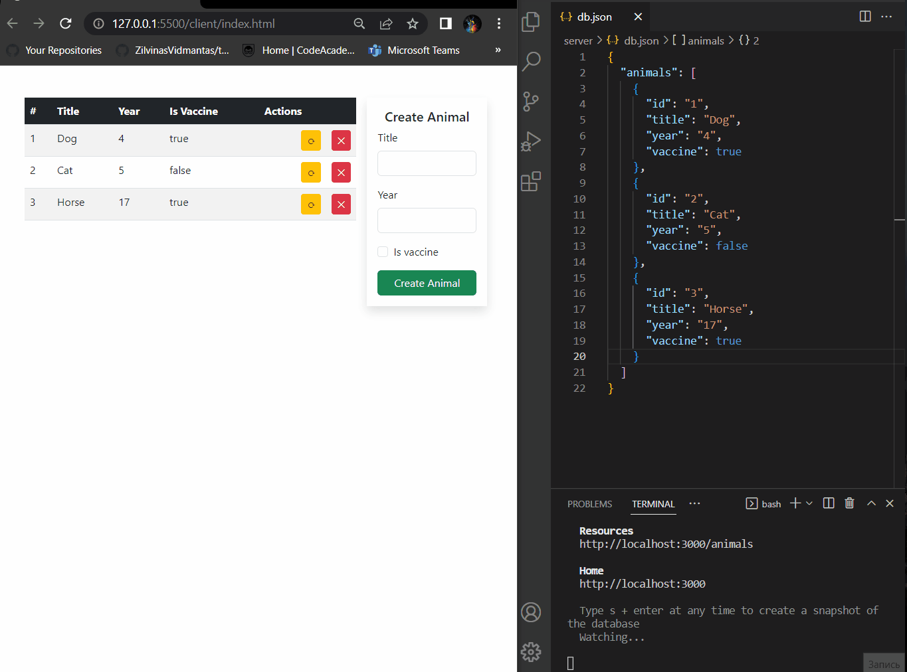

# Fullstack CRUD application

Program files are divided in two folders. Server and client folders. Server folder has it's own instructions in __readme.md__ file;

## Application example

## Code View

You can view code in Visual studio instance using [this link](https://github.dev/VadimTabelskij/js-dom)